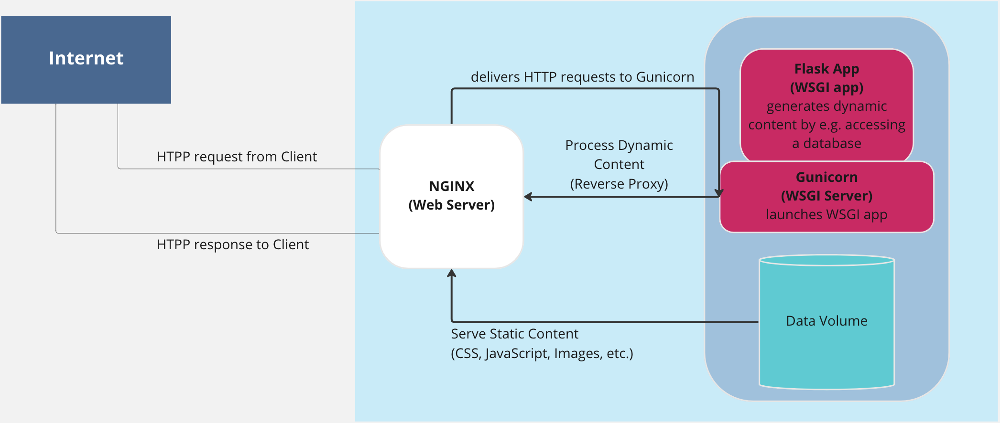

# Thoughtbook 📖

This application allows users to share their thoughts.
In detail this means uploading, updating and deleting posts.

You can visit the app here:
http://170.187.184.208/

## Documentation 📝

This diagram shows how the application is structured

To set this up on your machine as a development enviroment follow these steps: 👣

1. clone this repo
2. create a virtual environment in the root folder of the project with "python3 -m venv venv"
3. run the command "pip install -r requirements.txt" in your command line to install all the required packages
4. to specify how to load the application run "export FLASK_APP=run.py" 
5. now you can "flask run" the application
6. to run the application in debug mode run the command "flask --app run --debug run"

Tools used and Reasoning behind it:

### Flask:
Flask is a web application framework written in Python. It is designed to make getting started quick and easy, with the ability to scale up to complex applications. 

### Jinja2
Jinja2 is a template engine written in Python. It is designed to be used in conjunction with the Flask web framework, but can also be used with other web frameworks. 

### Bcyrpt
Bcyrpt is a hashing algorithm that was designed to be secure against brute-force attacks. In this application it's purpose is to hash the password created by the user. It is important to never store the plain text password in the database but also a hashing algorithm before storing.

### SQLAlchemy
SQLAlchemy is a Python library that provides a programmatic interface for accessing relational databases. It is also called an ORM (Object Relationship Mapping) and provides a way to perform CRUD operations without writing raw SQL statements.
It is designed to work with all major relational database systems, including PostgreSQL, MySQL, SQLite, Oracle, and Microsoft SQL Server.

### Gunicorn
Gunicorn is a Python WSGI HTTP Server for UNIX. It's purpose is to launch the WSGI app (Flask app).

### Nginx
Nginx is a web server that can be used to serve web pages. It can also be used as a reverse proxy, load balancer, and HTTP cache. It loads the static content of this web pages, such as the CSS.

